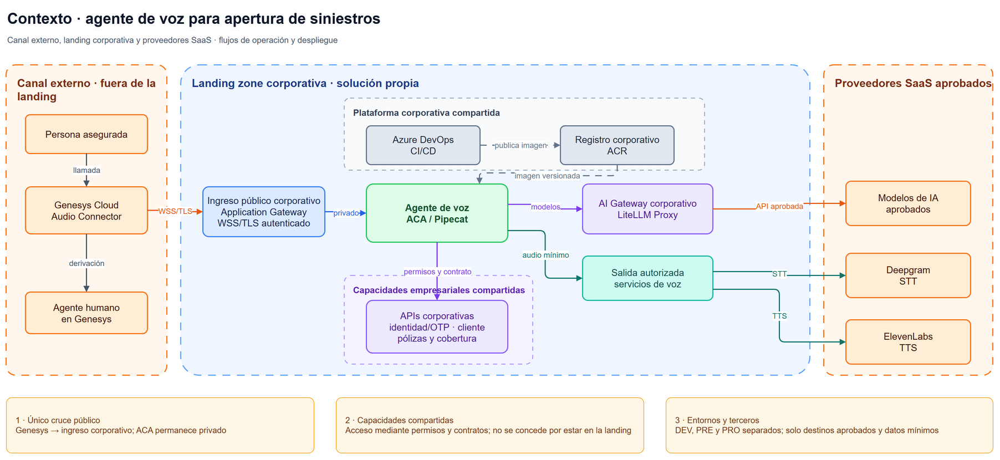
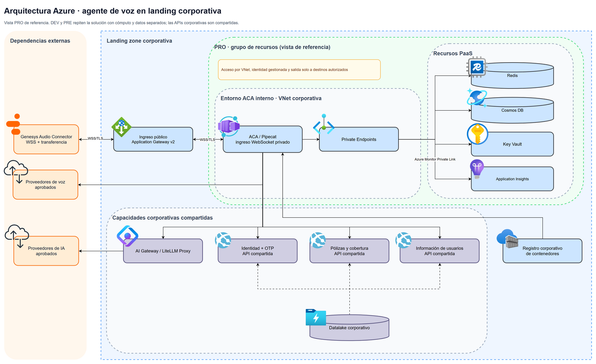

# Arquitectura Azure para un agente de voz de apertura de siniestros

## 1. Objetivo y alcance

Se propone un agente de voz que acompaña a una persona al abrir un siniestro: verifica su identidad y la cobertura aplicable, recoge la información, confirma lo entendido y registra el parte. Puede derivar la conversación a un agente humano en cualquier momento. Este documento describe dónde se ejecutaría, qué sistemas consultaría y cómo se protegería, escalaría y operaría. No incluye recursos Azure creados, infraestructura como código ni integraciones reales.

Se elige voz porque continúa el canal habitual de asistencia tras un siniestro. Se asume que la aseguradora ya utiliza Genesys Cloud Audio Connector y dispone de una landing zone corporativa que contiene toda la solución propia: ingreso, red y políticas comunes, registro de imágenes, AI Gateway, datalake, APIs de identidad/OTP y pólizas, y los grupos de recursos de DEV, PRE y PRO. Las APIs de identidad/OTP y pólizas son capacidades compartidas por todos los puntos de entrada de la aseguradora, no servicios exclusivos del agente de voz. Genesys y los proveedores SaaS aprobados son dependencias externas. Si alguna capacidad no existe, la propuesta debe adaptarse antes de implementarla.

## 2. Contexto y límites de confianza

Único cruce público: Genesys se conecta al ingreso de la landing zone mediante WSS/TLS. El ingreso autentica la conexión con un mecanismo compatible con el conector, aplica límites de tasa y reenvía el tráfico a ACA por red privada. La aplicación y los datos no se exponen directamente a Internet. La clave API planteada en el borrador sería distinta por entorno, se custodiaría en Key Vault. Dentro de la misma landing, el agente accede a identidad/OTP, servicios de datos de usuarios y pólizas mediante permisos y contratos propios de esos servicios compartidos.

El entorno de ACA se integra en la VNet corporativa con acceso interno. La aplicación habilita ingreso HTTP/WebSocket de tipo `external` respecto al entorno ACA para que Application Gateway pueda alcanzarla desde la VNet mediante el balanceador interno. El DNS privado resuelve el nombre del backend. Los Private Endpoints se usan para otras dependencias PaaS que los admitan cuando lo exija la política de red. La salida de ACA se limita a los destinos autorizados: APIs internas, almacenes, AI Gateway y telemetría.

Se presupone la existencia de un AI Gateway basado en LiteLLM Proxy que centraliza las llamadas a modelos de IA generativa. Aplica límites de uso por caso de uso y clave API, asigna los modelos autorizados y registra trazas técnicas. Antes de almacenar trazas, se propone detectar y ocultar datos personales con Azure AI Language.

### Diagrama de contexto

## 3. Componentes y responsabilidades

| Dominio                | Componente y decisión                                                                                                                                                                                                                                                                                                                                           |
| ---------------------- | ---------------------------------------------------------------------------------------------------------------------------------------------------------------------------------------------------------------------------------------------------------------------------------------------------------------------------------------------------------------- |
| Plataforma corporativa | Administra el ingreso público, conectividad, políticas, DNS, registro de imágenes y AI Gateway. Solo esta capa publica el punto de entrada para Genesys.                                                                                                                                                                                                      |
| Aplicación            | Azure Container Apps (ACA) ejecuta el contenedor del agente de voz con Pipecat. ACA facilita revisiones y escalado horizontal sin administrar un clúster AKS.                                                                                                                                                                                                   |
| Estado temporal        | Redis guarda estado y contexto mínimos de sesiones abiertas y permite localizar una conversación tras una reconexión. No es el registro duradero del parte ni una garantía de recuperación de identidad.                                                                                                                                                    |
| Datos duraderos        | Azure Cosmos DB guarda los partes de esta solución, resúmenes mínimos para derivaciones y métricas de uso (duración,  cantidad de turnos y resultado). Se asume API para MongoDB.                                                                                                                                                                         |
| Identidad y secretos   | Managed identities para las cargas Azure y Key Vault para credenciales externas y configuración sensible. La rotación automática mediante procesos programados se usa donde el proveedor lo permita. En los demás casos se define rotación operativa y auditoría.                                                                                          |
| IA                     | Un AI Gateway corporativo, propuesto sobre LiteLLM Proxy, centraliza el acceso, las cuotas, los costes y las trazas de los modelos. Azure AI Language puede detectar PII antes de registrar las trazas. Se proponen Deepgram para STT y ElevenLabs para TTS, condicionados a contratar y configurar las opciones de residencia y tratamiento de datos aprobadas. |
| Observabilidad         | Azure Monitor y Application Insights recogen salud, dependencias y trazas técnicas. El gateway mide el consumo de IA. Un cuadro de Power BI puede mostrar el coste medio por llamada y las tendencias. También se proponen alertas de costes anómalos diarios, semanales y mensuales mediante Azure Cost Management.                                          |
| Datos empresariales    | Las APIs privadas de identidad/OTP, datos de usuario y pólizas son las fuentes operativas. Si se alimentan del datalake corporativo, el agente accede a ellas mediante esas APIs.                                                                                                                                                                               |

### Diagrama de arquitectura

La landing zone contiene un grupo de recursos por entorno: DEV, PRE y PRO, además de las capacidades compartidas de identidad/OTP, pólizas y dato de usuarios que usan también otros canales. Cada grupo tiene recursos y datos separados. DEV tiene menor capacidad y PRE se dimensiona de forma comparable a PRO para las pruebas de carga. Los equipos propietarios de cada capacidad compartida mantienen sus contratos y permisos.

Cada grupo de recursos organiza su carga dentro de la landing zone. La separación de red se aplica además a las comunicaciones. El equipo de plataforma gobierna el ingreso y las políticas comunes, el de aplicación mantiene ACA, Redis y el esquema propio de Cosmos. Los equipos de datos mantienen las APIs compartidas de identidad/OTP, datos de usuarios y pólizas, sus contratos y permisos para todos los canales. Se usa una convención de nombres del tipo `{tipo}-{proyecto}-{entorno}-{región}-{número}`.

### Cobertura de los 11 resultados del enunciado

| Resultado solicitado            | Cómo lo cubre la propuesta                                                                                                                                                                                                                              |
| ------------------------------- | -------------------------------------------------------------------------------------------------------------------------------------------------------------------------------------------------------------------------------------------------------- |
| Aislamiento y gobierno          | La landing zone agrupa la solución propia, la separación de red, recursos y datos entre DEV, PRE y PRO y la asignación de políticas y responsables delimitan cada entorno.                                                                           |
| Acceso e identidades            | Los roles con IAM separan el acceso de personas por entorno, las cargas usan identidades gestionadas con mínimo privilegio y las altas, cambios y bajas implican revisión o revocación de permisos.                                                   |
| Privacidad y conectividad       | Genesys cruza por WSS/TLS un único ingreso público, mientras ACA y los datos permanecen privados y la salida se limita a destinos autorizados.                                                                                                         |
| Secretos y configuración       | Key Vault custodia las credenciales sensibles, con acceso controlado, rotación y auditoría, mientras la configuración ordinaria se versiona fuera del código y las imágenes.                                                                        |
| Datos y límites de tratamiento | La propuesta clasifica y minimiza los datos, exige cifrado y residencia aprobada, define retención y borrado según la normativa y la política corporativa, segrega los expedientes y excluye información sensible de trazas cuando no sea necesaria. |
| Ejecución y ciclo de vida      | ACA ejecuta el agente y Azure DevOps promociona el mismo artefacto versionado entre entornos con aprobaciones y posibilidad de volver a una revisión estable.                                                                                           |
| Escalabilidad y capacidad       | Los límites de réplicas y sesiones se ajustarían con pruebas de concurrencia WSS, mientras las cuotas y la admisión controlada protegen frente a la saturación.                                                                                     |
| Resiliencia y continuidad       | Se proponen para el futuro SLA una disponibilidad mensual del 99 %, un RTO de 4 horas y un RPO de 15 minutos para datos duraderos. La degradación deriva a humano y las copias se someten a pruebas de restauración.                                  |
| Operación y observabilidad     | Azure Monitor, Application Insights y el AI Gateway permiten seguir salud, latencia, dependencias, concurrencia, consumo y errores mediante trazas técnicas y alertas accionables.                                                                      |
| Entrega segura                  | Las PR revisadas, las comprobaciones de código, dependencias, secretos e imágenes, las aprobaciones por entorno y la reversión de ACA controlan cada promoción.                                                                                      |
| Coste y eficiencia              | Las cuotas de IA, los límites de réplicas, los TTL de datos y los presupuestos con alertas acotan los principales costes de voz, cómputo, almacenamiento y telemetría.                                                                               |

## 4. Recorrido de una petición

1. Genesys envía un identificador de sesión al abrir WSS. Tras autenticar el conector en el ingreso corporativo, ACA hace *get or create* del estado temporal en Redis y entrega los eventos a Pipecat.
2. El agente se identifica como IA y solicita los datos necesarios para verificar a la persona mediante la API interna y un OTP enviado al móvil. Se limitan los intentos. Un código permanente sería una alternativa si lo aprueba la política de seguridad corporativa. En caso contrario, se deriva a un agente humano.
3. Tras verificar la identidad, el agente recoge y categoriza el incidente, comprueba con la persona que ha entendido bien la situación y consulta la API de pólizas para verificar vigencia y cobertura. La IA estructura el relato pero la decisión de cobertura corresponde a la API autorizada o a una regla programática sobre los datos devueltos por ella, no a una respuesta libre del modelo.
4. Si no existe cobertura, informa del resultado y conserva el resumen mínimo de la gestión, con la opción de derivar a un agente humano.
5. Si procede el alta, la aplicación usa un identificador de solicitud estable para que un reintento no duplique el parte. Se incluye el parte en Cosmos DB y en caso de ser pertinente un CDC actualiza el datalake para que cualquier otro sistema pueda acceder a la información, notificando del alta donde sea pertinente. La confirmación solo se emite después de una escritura comprobada. El agente puede transferir la llamada a una cola de Genesys en cualquier momento, adjuntando únicamente un resumen sin información personal innecesaria.
6. Al cierre se almacenan metadatos mínimos de uso (duración, turnos, resultado y consumo) para operación y análisis de costes. El contenido completo de la conversación no se copia a la telemetría.
7. Durante la llamada se actualiza en Redis el estado mínimo necesario para continuar. Si se corta WSS y Genesys reintenta con el mismo identificador, se recupera ese estado solo si sigue vigente. La identidad se vuelve a verificar cuando corresponda y, si no es seguro continuar, se deriva a un agente humano.

### Fallos y degradación

| Dependencia                                | Respuesta prevista                                                                                                                       |
| ------------------------------------------ | ---------------------------------------------------------------------------------------------------------------------------------------- |
| Genesys o WSS se corta                     | Genesys reintenta con el ID de sesión. Se recupera Redis solo si el estado sigue siendo válido, si no, se revalida identidad o deriva. |
| Redis falla                                | No se presupone identidad verificada. Se inicia una sesión nueva o se transfiere a humano, un parte confirmado permanece en Cosmos.     |
| Identidad/OTP o pólizas falla             | Timeout y reintento acotado, se detiene el alta y se ofrece atención humana. Nunca se inventa identidad o cobertura.                    |
| AI Gateway o proveedor de voz/modelo falla | Se limita el reintento y se deriva a humano si el canal automático no puede continuar con seguridad.                                    |
| Cosmos no confirma el alta                 | Se consulta por identificador de solicitud antes de reintentar. No se anuncia «parte creado» con un resultado incierto.                |

## 5. Gobierno, seguridad y datos

Los desarrolladores acceden a Azure DevOps y DEV según su rol. Los cambios en PRE/PRO requieren permisos separados, aprobación y auditoría. Las managed identities tienen acceso mínimo a sus dependencias. Las altas, cambios y bajas de personas o cargas implican revisión o revocación de permisos y secretos. La configuración ordinaria se versiona por entorno.

Se clasifican DNI/OTP, audio, transcripciones y partes como información sensible. El tráfico va cifrado y los almacenes aplican cifrado en reposo, residencia en la región aprobada y acceso segregado por cliente o expediente. Redis conserva estado temporal con un TTL propuesto de dos horas tras la última interacción, los metadatos de uso tienen un plazo configurable según la política de gestión de datos. La conservación y el borrado de partes siguen la política corporativa que confirmen los responsables de datos y privacidad. La aplicación no almacena audio bruto, la posible grabación en Genesys sigue su propia política. Las trazas emplean un identificador de correlación opaco, sin DNI completo, OTP, audio ni descripciones sensibles.

La residencia europea de los proveedores de voz es una condición de selección y configuración, no una propiedad automática de sus servicios estándar. Para Deepgram se propone el endpoint de la UE y la exclusión del uso de datos para mejora de modelos mediante `mip_opt_out=true`. Para ElevenLabs se requiere un entorno aislado de residencia UE contratado como función Enterprise. Si se exige también procesamiento dentro de la UE, deben validarse Zero Retention Mode, el uso de la API y las integraciones opcionales. Los equipos de seguridad y privacidad deben aprobar estos contratos y flujos antes de utilizar datos reales.

## 6. Entrega, escalado y continuidad

El código vive en Azure DevOps con un GitFlow simplificado: una PR revisada hacia `dev` despliega el entorno de desarrollo, una etiqueta de versión validada promociona el mismo artefacto a preproducción y tras revisión funcional y prueba de carga, se promociona el mismo digest a PRO con aprobación separada. El pipeline ejecuta `ty`/`Ruff`, `Sonar` y `pytest`, comprueba dependencias, secretos e imágenes y publica en el registro corporativo. Las revisiones de ACA permiten volver a una versión estable. La definición de infraestructura y la configuración se versionarían para hacer el cambio reproducible.

ACA mantiene una réplica caliente en PRO para reducir la latencia de arranque. Los límites de réplicas y sesiones activas por réplica se fijan tras una prueba corta de concurrencia WSS. Se propone escalar horizontalmente con KEDA a partir de una métrica de sesiones WSS activas, donde cada sesión corresponde a una llamada. Ante saturación o cuotas de IA, se limita la admisión y se devuelve la llamada a Genesys para atención humana. Al desescalar, se dejan de aceptar llamadas nuevas y se concede un plazo para terminar o transferir las activas, calculado a partir de la duración observada de las llamadas.

Como objetivos de diseño para acordar en un futuro SLA, se proponen una disponibilidad mensual del 99 % del canal automatizado, un RTO máximo de 4 horas y un RPO máximo de 15 minutos para los datos duraderos ante una restauración. La continuidad ante una caída del agente se apoya en la derivación a atención humana. La cobertura de una pérdida regional completa requeriría revisar la configuración multirregión, el coste y los objetivos acordados. La pérdida de estado efímero puede obligar a repetir la identificación, pero no debe duplicar un alta.

Azure Monitor y Application Insights permiten seguir errores de WSS, salud de ACA, latencia, fallos de dependencias, escrituras inciertas, concurrencia y cuotas. Cada alerta debe llevar a una acción: revisar, revertir revisión, limitar tráfico o derivar a atención humana.

## 7. Coste y eficiencia

| Generador                | Comportamiento y control                                                                                                                                                      |
| ------------------------ | ----------------------------------------------------------------------------------------------------------------------------------------------------------------------------- |
| Voz e IA                 | El coste varía con minutos, turnos y volumen de prompts. LiteLLM aplica cuotas, límites por sesión y seguimiento por entorno.                                              |
| ACA                      | Tiene un coste base por réplicas calientes y variable por concurrencia. Se acotan `min/maxReplicas` y las sesiones por réplica.                                          |
| Red y servicios de datos | Tráfico entrante/saliente, Redis, Cosmos y operaciones de almacenamiento, Private Endpoints cuando se use para dependencias PaaS. Se revisan rutas, tamaño de datos y TTL. |
| Telemetría              | Crece con volumen y retención. Se registran eventos estructurados mínimos y se limita el detalle y el plazo.                                                                |

Azure Cost Management aporta presupuestos y alertas de gasto. El cuadro de Power BI propuesto combina métricas de LiteLLM y de uso en Cosmos para mostrar coste y duración por llamada, tendencias y resultados. Sirve para analizar, mientras que cuotas y límites de escalado controlan el consumo inesperado.

## 8. Decisiones y alternativas descartadas

| Decisión                            | Alternativa                                                    | Motivo y condición de revisión                                                                                                                                                                                                                                  |
| ------------------------------------ | -------------------------------------------------------------- | ----------------------------------------------------------------------------------------------------------------------------------------------------------------------------------------------------------------------------------------------------------------- |
| Voz mediante Genesys Audio Connector | Chat o integración SIP propia                                 | La llamada se adapta al canal habitual de asistencia y aprovecha Genesys, pero esto añade coste y dependencia de un tercero. SIP se reconsideraría si hiciese falta reducir costes manteniendo el canal de voz. Chat, si negocio prioriza un canal más barato. |
| ACA                                  | VM Scale Sets                                                  | VMSS da más control de máquina, pero exige más administración y no simplifica el problema actual. Se reconsideraría por requisitos de red o ejecución no compatibles con ACA.                                                                               |
| ACA                                  | AKS                                                            | AKS ofrece más flexibilidad, pero añade complejidad operativa para un agente acotado. Podría ser apropiado si la solución crece a varios servicios con necesidades de orquestación complejas.                                                                |
| APIs privadas para datos operativos  | Consulta directa del datalake o copia local de todos los datos | Las APIs concentran permisos y evitan acoplar el agente al lago. La copia local amplía duplicación y gobierno, por otro lado, la consulta directa dificulta control de acceso y coste por operación.                                                           |
| Azure Monitor y App Insights         | Almacén y visualizador de trazas propios                      | La opción corporativa aprovecha integración y alertas ya disponibles, y la alternativa propia requeriría mantenimiento adicional.                                                                                                                              |
